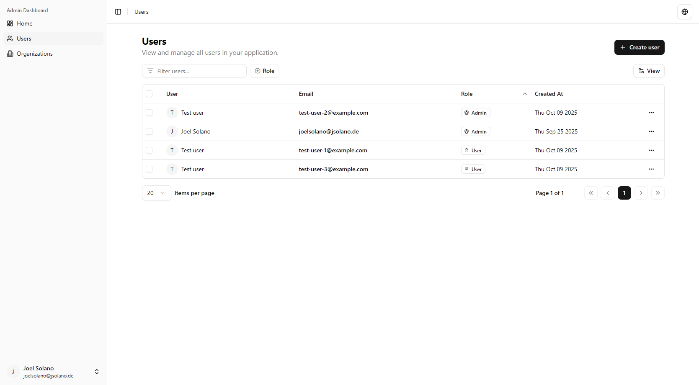

<h1>
    @better-auth-extended/dashboard
</h1>

A [Better-Auth](https://better-auth.com) powered admin dashboard.

> [!CAUTION]
> This package is not ready.

## Features

- 🫵 Served on your site.
- ⚙️ Configure plugins straight from the dashboard.
- 👮‍♂️ View & manage users, organizations, and more.
- 🌐 Internationalization support.
- and more...

## Screenshots

### Home

_coming soon_

### Users

### Organizations

_coming soon_

## Themeing and Components

Everything in the dashboard is built on top of [ShadCN UI](https://ui.shadcn.com/) components from YOUR app.

Meaning you can control how the components look and act, as well as style or theme them as you desire.

## Plugins

@better-auth-extended/dashboard works dynamically by utilizing plugins, this allows you to control what components you want to see in your dashboard, as well as extending it if you wish.

## Get Started

_TODO_

## References

- [better-auth-dashboard](https://github.com/ping-maxwell/better-auth-dashboard)

## License

[MIT](./LICENSE.md)
